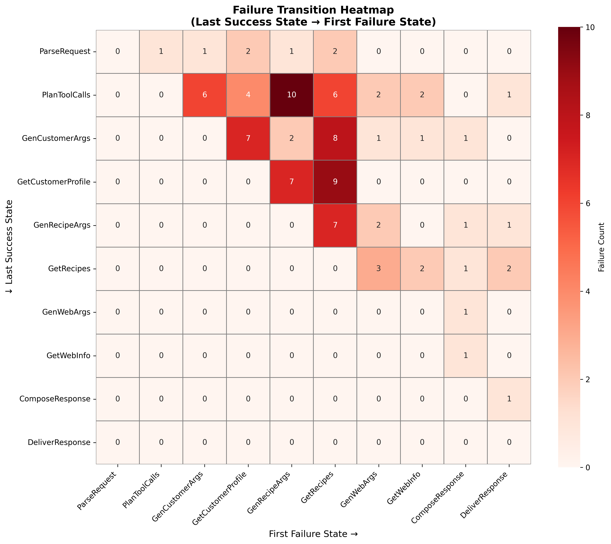

# HW5 Failure Transition Analysis

**Date**: 2025-11-14
**Author**: [Your Name]
**Assignment**: Homework 5 - Failure Transition Heat-Map

---

## Executive Summary

*[Write 2-3 sentences summarizing your key findings]*

Example:
> Analysis of 96 failure traces reveals that recipe-related operations (GetRecipes and GenRecipeArgs) account for XX% of all failures. Tool execution states ("Get...") fail more frequently than argument generation states ("Gen..."), suggesting infrastructure or database issues rather than LLM prompt problems. The most common failure transition is [X → Y], occurring in Z traces.

---

## Methodology

**Dataset**: 96 labeled conversation traces from cooking assistant agent
**Approach**: Built transition matrix counting (last_success_state → first_failure_state) pairs
**Visualization**: 10x10 heatmap showing failure transition frequencies
**Analysis Tools**: Pandas for data aggregation, Seaborn for visualization

---

## 1. Which States Fail Most Often?

### Top Failure States

*[Fill in from your Notebook 03 data]*

| Rank | State | Count | Percentage |
|------|-------|-------|------------|
| 1 | [State Name] | XX | XX% |
| 2 | [State Name] | XX | XX% |
| 3 | [State Name] | XX | XX% |
| 4 | [State Name] | XX | XX% |
| 5 | [State Name] | XX | XX% |

### Analysis

*[Write 3-4 sentences explaining what this tells you]*

Questions to answer:
- Which state fails most? Why might this be?
- Are the top failures related to each other?
- What's notable about states that DON'T fail much?

Example:
> GetRecipes is the #1 failure point with XX failures (XX% of total). This is surprising because it's querying our own internal database, which should be more reliable than external web searches. GenRecipeArgs is the #2 failure with XX failures, suggesting the issue might be in how arguments are constructed before the database query, rather than the database itself.

---

## 2. Do Failures Cluster Around Tool Execution or Argument Generation?

### Gen vs Get Distribution

*[Fill in from your Step 5 analysis in Notebook 03]*

| Category | Count | Percentage | Description |
|----------|-------|------------|-------------|
| **Gen...** (Argument Generation) | XX | XX% | LLM creating arguments for tools |
| **Get...** (Tool Execution) | XX | XX% | Actually executing tools |
| **Other** | XX | XX% | Parse, Plan, Compose, Deliver |

### Analysis

*[Write 3-4 sentences about what this clustering means]*

Questions to answer:
- Which category has more failures?
- What does this tell you about where the root cause is?
- Is this an LLM problem (can't generate good arguments) or an infrastructure problem (tools don't work)?

Example from Workshop:
> Isaac noted: "Get... states have XX failures while Gen... states have XX failures. This suggests [infrastructure/LLM] is the primary issue. If it were a prompt problem, we'd expect more Gen... failures where the LLM can't figure out the right arguments. But since Get... fails more, it points to [database/API/tool] issues."

---

## 3. Any Surprising Low-Frequency Transitions?

### Rare or Non-Existent Transitions

*[Look at your heatmap for white/light pink cells]*

Things to note:
- States that almost never fail
- Transitions that never occur
- Expected failures that don't happen

Example:
> GetWebInfo only accounts for X failures (X%), which is surprisingly low considering it relies on external APIs. This suggests that external web search is actually more reliable than our internal recipe database. ParseRequest and PlanToolCalls rarely fail directly, which makes sense as these are pure LLM operations without external dependencies.

---

## 4. Most Common Failure Transitions

### Top 3 Transitions

*[From your Notebook 02 and 03 analysis]*

**1. [State A] → [State B]: XX failures**
- *What this transition represents*
- *Why it might fail*
- *Example from traces*

**2. [State C] → [State D]: XX failures**
- *What this transition represents*
- *Why it might fail*
- *Example from traces*

**3. [State E] → [State F]: XX failures**
- *What this transition represents*
- *Why it might fail*
- *Example from traces*

---

## 5. Recipe vs Customer vs Web Analysis

*[From your domain analysis in Notebook 03]*

| Domain | Failure Count | Percentage |
|--------|---------------|------------|
| Recipe-related | XX | XX% |
| Customer-related | XX | XX% |
| Web-related | XX | XX% |
| Other | XX | XX% |

### Analysis

*[Write 2-3 sentences about domain patterns]*

Workshop insight to consider:
> Isaac said: "Why are GetRecipes and GetCustomerProfile failing so much? These are OUR databases. We control them. I'd expect GetWebInfo to fail more because that's external. This makes me think there's something wrong with our database queries or tool definitions."

---

## 6. Patterns and Root Cause Hypotheses

*[This is the most important section - show your critical thinking!]*

### Key Patterns Observed

1. **Pattern 1**: [Describe what you see]
   - *Evidence*: [Numbers/transitions that support this]
   - *Hypothesis*: [What might be causing this]

2. **Pattern 2**: [Describe what you see]
   - *Evidence*: [Numbers/transitions that support this]
   - *Hypothesis*: [What might be causing this]

3. **Pattern 3**: [Describe what you see]
   - *Evidence*: [Numbers/transitions that support this]
   - *Hypothesis*: [What might be causing this]

### Potential Root Causes

Based on the failure patterns, here are my hypotheses:

**Hypothesis 1: Database Connection Issues**
- *Evidence*: GetRecipes and GetCustomerProfile are top failures
- *Why*: Internal database queries shouldn't fail this often
- *Next step to investigate*: Check database logs, connection pooling, timeout settings

**Hypothesis 2: Tool Definition Problems**
- *Evidence*: [Your observation]
- *Why*: [Your reasoning]
- *Next step to investigate*: [What you'd check]

**Hypothesis 3: [Your hypothesis]**
- *Evidence*: [Your observation]
- *Why*: [Your reasoning]
- *Next step to investigate*: [What you'd check]

### Workshop Insights Applied

*[Reference specific things Isaac mentioned that you explored]*

Example:
> Following Isaac's suggestion, I grouped states by their first 3 characters. This revealed that "Get" failures (XX%) far exceed "Gen" failures (XX%), supporting the hypothesis that this is an infrastructure issue rather than an LLM prompt issue. Isaac also questioned whether GetCustomerProfile should even be a tool - perhaps customer preferences should be automatically injected into every prompt rather than requiring a tool call that can fail.

---

## 7. Surprising Findings

*[Anything that surprised you or went against your initial expectations?]*

Things to consider:
- Did the #1 failure surprise you?
- Were there states you expected to fail that didn't?
- Did the Gen vs Get breakdown match your intuition?

---

## 8. What to Investigate Next

*[If you were on the engineering team, what would you do with this information?]*

**Immediate Actions**:
1. [Specific thing to check]
2. [Specific thing to check]
3. [Specific thing to check]

**Medium-term Improvements**:
1. [Architectural change or fix]
2. [Architectural change or fix]

Example from Workshop:
> Isaac suggested: "I'd want to drill into these traces and see what was passed into the tool calls. What plan was created by PlanToolCalls? What arguments were generated by GenRecipeArgs? We need more visibility into the intermediate steps, not just success/failure flags."

---

## 9. Limitations of This Analysis

*[Be honest about what this analysis can and can't tell you]*

Example:
> This analysis shows WHERE failures happen (which state transitions), but doesn't show WHY they happen (the actual error messages or root causes). To truly fix these issues, we'd need to examine error logs, actual argument values passed to tools, and database query results. The transition matrix is a great starting point for knowing where to focus debugging efforts, but it's not a complete diagnosis.

---

## Conclusion

*[Wrap up with 2-3 sentences summarizing key takeaways and recommended next steps]*

Example:
> The failure analysis reveals that XX% of failures occur in recipe-related operations, with GetRecipes being the #1 failure point. The clustering of failures in "Get" states rather than "Gen" states suggests infrastructure or database issues rather than LLM prompt problems. I recommend investigating [specific thing] first, followed by [specific thing], to address the root causes of these failures.

---

## Appendix: Visualizations

### Failure Transition Heatmap

*Heatmap showing frequency of transitions from last successful state (rows) to first failure state (columns). Darker red indicates higher failure counts.*

---

## Reflection

*[Optional: What did you learn from this analysis?]*

- About the agent's behavior?
- About failure analysis methodology?
- About data visualization?
- About debugging complex systems?

---

**Analysis completed**: [Date]
**Tools used**: Pandas, NumPy, Matplotlib, Seaborn, Marimo
**Total traces analyzed**: 96
**Total unique transitions**: [Fill in]
**Most common transition**: [Fill in]
